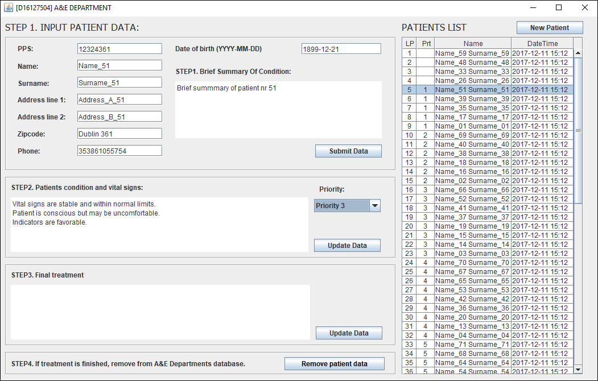

# Ae Dpartment (CA3 – Project)

### Description:
A new medical facility in Dublin needs a software solution for their accident and emergency
department (A&E). The A&E department will treat patients who present without a prior
appointment. As there are no scheduled appointments and the randomness of when patients may
attend the A&E department, an algorithm needs to be implemented to ensure that the patient with
the most serious condition gets seen by the doctor in a timely fashion.

The Chief Medical Officer (CMO) of the medical facility has provided the following operational
description of how the A&E department should operate when dealing with a new patient

**Step 1:** Patient presents in the A&E department and gives their personal details to the receptionist.
The receptionist will record all personal details in the system along with a brief summary of
the condition the patient has. The patient will be asked to sit in the waiting department to be
called.

**Step 2:** The patient will be called into an assessment room to be seen by the triage nurse. The triage
nurse will assess the patients condition and take their vital signs. A priority value of 1 to 10
will be assigned to the patients condition, this will be used to determine how quickly they
will get to see the doctor. These details will be stored in the system.

**Step 3:** The patient will be called to see the doctor. When the doctor has completed treating the
patient, a summary of the treatment is entered into the system and the patient is removed
from the treatment list.

## Project Requirements:

  - Create a system to manage the A&E departments patient treatment as detailed above.
  - he project should be developed following good design principles.
  - he system must offer data persistence for all patient details and all patient transactions. The
data persistence functionality should be encapsulated in a separate class.
  -  GUI using Java Swing must be provided to facilitate ease of use for the
Doctors/Nurses/Receptionists. The GUI must display all information for all users of the
system. (Including priority and all inputs from users).
  -  Doubly Linked List (DLL) should be used to store patient information.
  -  Note: Other data structures may be used, this must be justified in your report.

Screenshot:

